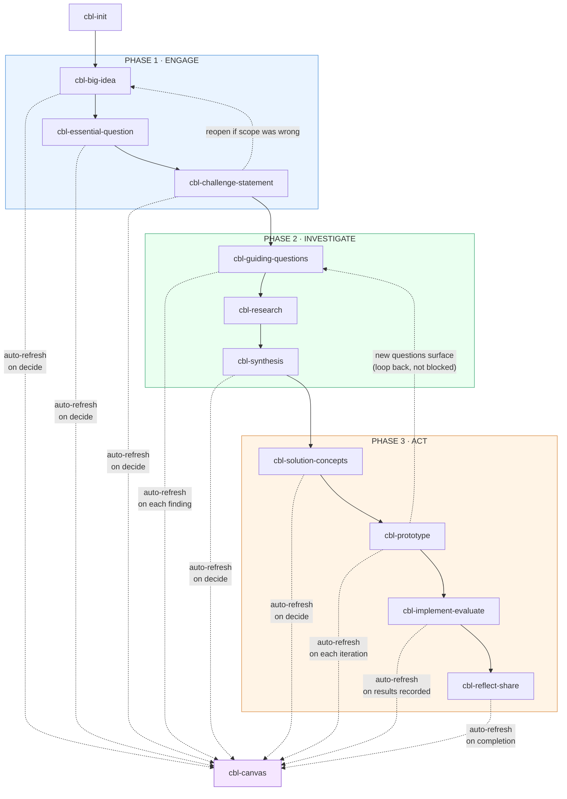
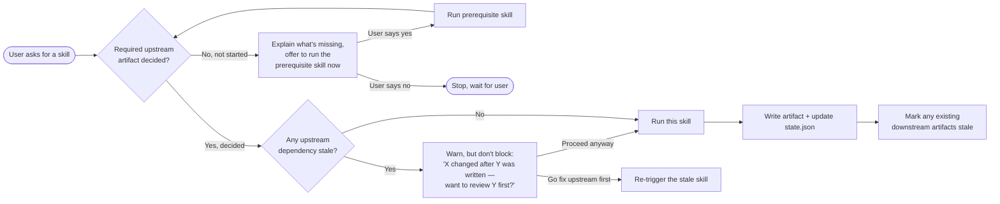
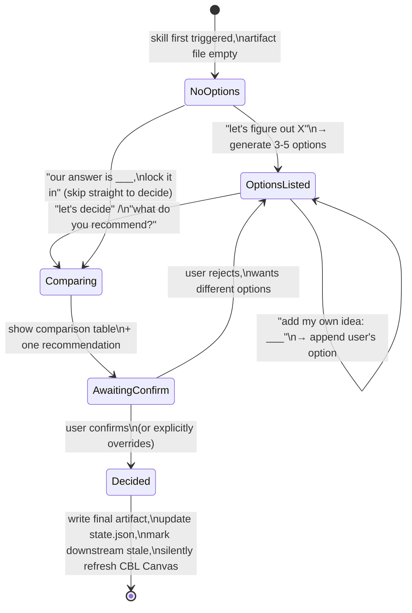
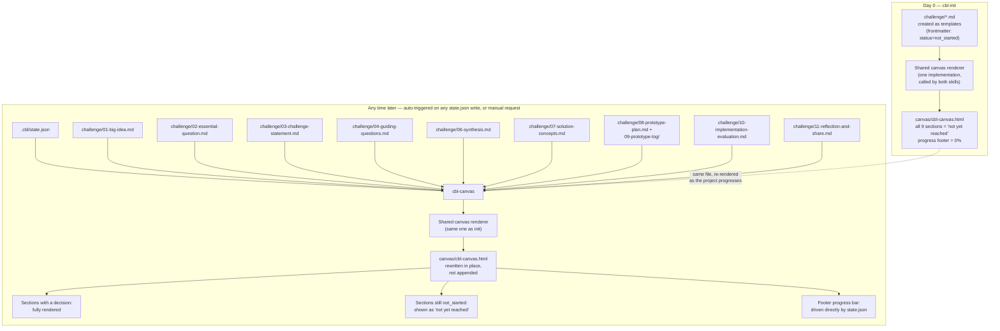

# CBL Skill Flow — Diagrams

Companion to `01-cbl-skills-architecture-plan.md`. These are Mermaid diagrams — they render inline on GitHub, GitLab, most markdown viewers, and Mermaid Live Editor. If your viewer doesn't render Mermaid, paste the code blocks into https://mermaid.live.

---

## 1. Overall Phase Flow (CBL framework, as skills)

Shows the three CBL phases, the artifact each skill produces, and where the process is allowed to loop backward (dashed lines) versus only ever move forward (solid lines).



**Reading this**: solid arrows are the normal forward path each skill gates on. The two backward-loop dashed arrows (Act → Investigate, Challenge Statement → Big Idea) are expected and supported, not errors — see §5 of the architecture plan for how staleness flags this without blocking anyone. The dashed arrows into `cbl-canvas` are a different kind of "anytime" — every one of them fires automatically the moment its source skill writes a state change, with no user request needed (architecture plan §2, principle 6).

---

## 2. Skill Dependency / Gating Graph

A more literal view of what each skill checks for before it will proceed, and what "auto-offer to run the missing prerequisite" looks like as a decision tree.



---

## 3. Generate → Add → Decide Sub-Flow (inside one skill)

This is the internal conversational logic described in §6 of the architecture plan — how a single skill like `cbl-big-idea` handles generating, accepting user ideas, and deciding, all as one continuous conversation.



---

## 4. Team Collaboration & Git Flow

How a distributed team's work moves from an individual's scratch folder into the canonical `challenge/` documents.

```mermaid
sequenceDiagram
    participant M as Teammate (own machine)
    participant F as team/&lt;name&gt;/ (scratch)
    participant B as git branch (team/&lt;name&gt;)
    participant C as challenge/ (canonical, main)
    participant Merge as cbl-merge

    M->>F: Draft ideas, notes,\nresearch-in-progress
    Note over F: Low-friction, no review needed,\ngit-tracked for history only

    M->>B: Push anything meant\nfor team review
    M->>Merge: "help me merge my\nGuiding Questions research"

    Merge->>B: Read teammate's branch
    Merge->>C: Diff against canonical doc
    Merge-->>M: Show conflicts in plain language\n(not raw git markers)
    M->>Merge: Resolve / confirm
    Merge->>C: Commit merged result to main
    Merge->>C: Update .cbl/state.json
```

---

## 5. CBL Canvas Data Flow — From Init to Full Story

How the canvas first appears (empty, at init) and then gets re-rendered as real content gets decided. Both `cbl-init` and `cbl-canvas` call the same underlying renderer — one rendering path, two entry points (see architecture plan §3a).



---

## Notes on Using These Diagrams

- Diagram 1 is the one to show a new team member on day one — it's the whole system at a glance.
- Diagram 2 is what the skill-builder (me, later) will translate directly into each `SKILL.md`'s opening gating check.
- Diagram 3 is the one worth re-reading if a generate/decide interaction feels confusing in practice — it's the exact state machine each of the five divergent-decision skills implements.
- Diagrams 4 and 5 are scoped to features that depend on open items in the architecture plan (§7's GitHub connector question, and the canvas skill being newly added) — expect these two to get more detail once those are settled.
- Diagram 5's "any time later" subgraph is doing double duty: it fires automatically every time any other skill writes to `.cbl/state.json` (architecture plan §2, principle 6), and it's also what runs if a user manually asks to see the canvas. Same rendering path either way.
